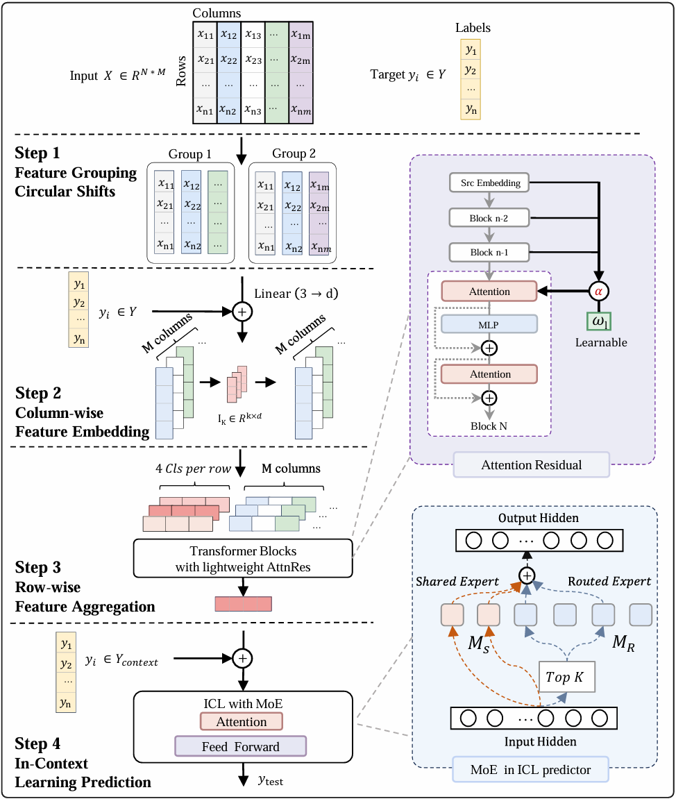
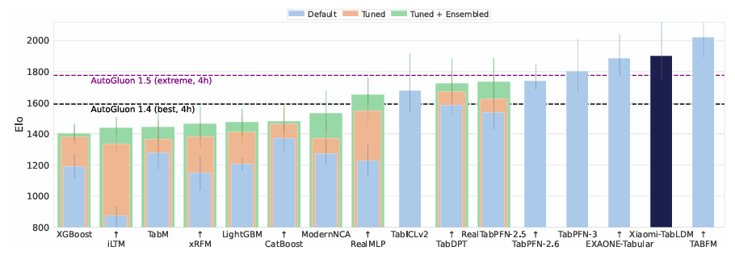
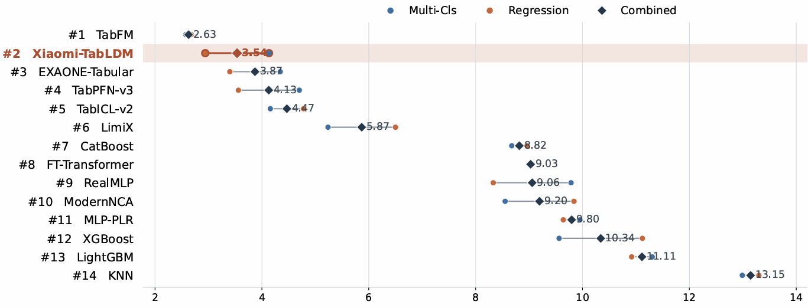
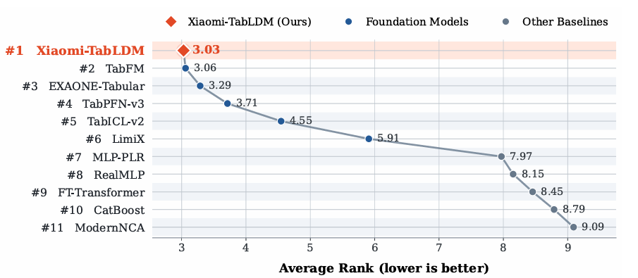

<h3 align="center">
  <b>
    <span>━━━━━━━━━━━━━━━━━━━━━━━━━━━━━━━━━━━━━━━━━━</span>
    <br/>
    Xiaomi-TabLDM: A Tabular Large Data Foundation Model<br/>For Classification and Regression via In-Context Learning
    <br/>
    <span>━━━━━━━━━━━━━━━━━━━━━━━━━━━━━━━━━━━━━━━━━━</span>
    <br/>
  </b>
</h3>

<div align="center" style="line-height: 1;">
  <a href="https://huggingface.co/occams/Xiaomi-TabLDM" target="_blank">🤗 HuggingFace</a>
  &nbsp;|
  <a href="https://arxiv.org/abs" target="_blank">📔 Technical Report</a>
  &nbsp;|
  <a href="README_CN.md" target="_blank">中文</a>
  &nbsp;|
  English
  &nbsp;
</div>

<br/>

---

This repository is the official implementation of **Xiaomi-TabLDM**.

Tabular foundation models establish a general prediction paradigm based on in-context learning. Given labeled samples from a downstream dataset as context, a single pretrained model can make predictions directly without task-specific training. Building on this paradigm, we introduce Xiaomi-TabLDM, a tabular large data foundation model for classification and regression via in-context learning, which delivers superior prediction accuracy without requiring task-specific fine-tuning. Pretrained exclusively on synthetic data generated from structural causal models (SCMs), our model enables more flexible context utilization and more efficient capacity scaling.

**A New Performance Standard.** _Strong regression performance across benchmarks_: Xiaomi-TabLDM ranks 1st on OpenML-CTR23 and 2nd on regression across TALENT, TabArena, and BCCO, demonstrating consistently strong regression performance across four complementary benchmark suites. _Favorable performance–efficiency trade-off_: Xiaomi-TabLDM combines strong predictive performance with substantially lower computational cost. For example, on TabArena regression, it achieves the second-highest Elo while using 82% less training time and 68% less prediction time than the top-ranked TabFM.

**Large-Scale Synthetic Pretraining.** Xiaomi-TabLDM expands the coverage and diversity of synthetic tabular data used for pretraining. We also adopt a three-stage training strategy together with dual-stream feature grouping, lightweight Attention Residual, and sparse Mixture-of-Experts, enabling Xiaomi-TabLDM to learn richer feature interactions and expert specialization across diverse tabular tasks.

**Test-Time Scaling.** Xiaomi-TabLDM further extends tabular prediction through test-time compute scaling: allocating additional computation at inference time consistently improves predictive performance over the base model.

**Easy to Use:** Xiaomi-TabLDM can be installed with `pip` and provides a scikit-learn-compatible interface. `fit` does not update model weights; it only preprocesses the context and loads the pretrained model. Predictions are produced through in-context learning in a single forward pass.

**Fast:** With KV caching, repeated calls to `predict` on the same training data can reuse cached context projections, significantly accelerating repeated inference. A GPU is recommended for larger datasets, and CPU/disk offloading can be used to scale to larger data sizes.

<div align="center">
  
</div>

## Performance

<div align="center">
  
  <br>
  <em>Figure 1. Regression average-rank performance on TALENT (lower is better)</em>
</div>

<br>

<div align="center">
  
  <br>
  <em>Figure 2. Regression Elo performance on TabArena (higher is better).</em>
</div>

<br>

<div align="center">
  
  <br>
  <em>Figure 3. Average-rank comparison on BCCO. Circles denote the average ranks on BCCO-CLS and BCCO-REG, while diamonds denote the overall average rank across the two settings. Models are ordered
by the combined average rank; lower is better. </em>
</div>

<br>

<div align="center">
  
  <br>
  <em>Figure 4. Average-rank comparison on OpenML-CTR23 over 33 regression datasets (lower is better).</em>
</div>

## Installation

```bash
cd xiaomi-tabldm
pip install .
```

Install optional dependencies as needed:

```bash
pip install .[numba]   # Optional JIT acceleration for the quantile distribution layer
pip install .[test]    # Test dependencies
```

Installing PyTorch with `pip` may fail on Intel Macs. If so, install PyTorch first:

```bash
conda install pytorch -c pytorch
```

### Dependencies

`torch>=2.2`, `scikit-learn>=1.3.0`, `numpy`, `scipy`, `einops>=0.7`,
`psutil`, `tqdm>=4.64.0`, and `huggingface-hub`. `numba` is optional.

## Basic Usage

### Classification

```python
from tabldm import TabLDMClassifier

clf = TabLDMClassifier(model_path="checkpoints/clf_default.ckpt")
clf.fit(X_train, y_train)          # In-context learning: no weight updates
pred = clf.predict(X_test)
proba = clf.predict_proba(X_test)  # (n_test, n_classes)
```

### Regression

```python
from tabldm import TabLDMRegressor

reg = TabLDMRegressor(model_path="checkpoints/reg_default.ckpt")
reg.fit(X_train, y_train)
pred = reg.predict(X_test)
```

> `fit` **does not train the model**. It only preprocesses the labeled context
> (`X_train`, `y_train`) and loads the pretrained weights. Prediction is performed
> entirely through in-context learning. On first use, the checkpoint is downloaded
> automatically from the Hugging Face Hub. Specify `model_path` to use a local file
> for offline inference.

### KV Cache

When calling `predict` multiple times with the same training data, such as during
evaluation, enabling KV caching avoids repeatedly computing the context. The cache
is built during `fit` and reused across subsequent `predict` calls. Note that this
requires additional GPU/CPU memory, so choose the setting based on your use case:

> KV caching is not supported for classification tasks with more than 10 classes.
> Keep `kv_cache=False` (the default) for these datasets; otherwise `fit` raises an
> error.

```python
clf = TabLDMClassifier(
    kv_cache=True, model_path="checkpoints/clf_default.ckpt"
)
clf.fit(X_train, y_train)          # Build the cache once
clf.predict(X_test_batch_1)        # Reuse the cached context
clf.predict(X_test_batch_2)
```

### Save/Load

```python
clf.save(
    "classifier.pkl",
    save_model_weights=False,  # If False, reload weights from the checkpoint
    save_training_data=True,   # If True, include training data; False improves privacy
    save_kv_cache=True,        # Save the KV cache when available
)

from tabldm import TabLDMClassifier
clf = TabLDMClassifier.load("classifier.pkl")
```

When `save_model_weights=False` (the default), the saved file is smaller, but the
weights must be reloaded from `model_path` or the Hub when loading the estimator.

## Advanced Configuration

Xiaomi-TabLDM provides a set of parameters for customizing inference behavior. The following
example shows all available classifier parameters and their default values:

```python
from tabldm import TabLDMClassifier

clf = TabLDMClassifier(
    n_estimators=8,               # Ensemble members; more is more accurate but slower
    norm_methods=None,            # Normalization methods to try
    feat_shuffle_method="latin",  # Feature permutation strategy
    class_shuffle_method="shift", # Class permutation strategy
    outlier_threshold=4.0,        # Z-score threshold for outlier detection/clipping
    softmax_temperature=0.9,      # Temperature controlling prediction confidence
    average_logits=True,          # Average logits (True) or probabilities (False)
    support_many_classes=True,    # Automatically handle more than 10 classes
    batch_size=8,                 # Ensemble members processed together; lower saves memory
    kv_cache=False,               # Cache training-data KV projections for repeated inference
    model_path=None,              # Checkpoint path; None downloads from Hugging Face
    allow_auto_download=True,     # Download automatically when not found locally
    checkpoint_version="checkpoints/clf_default.ckpt",  # Pretrained checkpoint version
    device=None,                  # Inference device; None selects CUDA or CPU automatically
    use_amp="auto",               # Automatic mixed precision for faster inference
    use_fa3="auto",               # Flash Attention 3 on Hopper GPUs such as H100
    offload_mode="auto",          # Decide automatically when to use CPU/disk offloading
    disk_offload_dir=None,        # Directory for disk offloading
    random_state=42,              # Random seed for reproducibility
    n_jobs=None,                  # Number of PyTorch threads for CPU inference
    verbose=False,                # Print detailed inference information
    inference_config=None,        # Fine-grained inference control for advanced users
)
```

`TabLDMRegressor` accepts the same parameters except for the classification-specific
parameters `class_shuffle_method`, `softmax_temperature`, `average_logits`, and
`support_many_classes`.


## Loading Checkpoints

Checkpoints are resolved in the following order:

1. **`model_path`** — If it points to an existing file, that file is used directly.
2. If `model_path` is set but the file does not exist and `allow_auto_download=True`,
   the checkpoint named by `checkpoint_version` is downloaded to `model_path`.
3. If `model_path` is `None`, the checkpoint is retrieved from the Hugging Face Hub
   cache using `checkpoint_version` as the key.


The `checkpoint_version` value is the filename inside the Hugging Face repository, not a
local filesystem path. The first lookup uses the local Hugging Face cache
(typically `~/.cache/huggingface/hub`); if the file is not cached and
`allow_auto_download=True`, it is downloaded automatically.

For fully offline inference, point `model_path` to a local file:

```python
clf = TabLDMClassifier(
    model_path="checkpoints/clf_default.ckpt", allow_auto_download=False
)
```

## Available Models

| Model          | Classifier           | Regressor           |
| -------------- | -------------------- | ------------------- |
| **Xiaomi-TabLDM** | [`XiaomiTabLDMClassifier`](https://huggingface.co/occams/Xiaomi-TabLDM/resolve/main/checkpoints/clf_default.ckpt) | [`XiaomiTabLDMRegressor`](https://huggingface.co/occams/Xiaomi-TabLDM/resolve/main/checkpoints/reg_default.ckpt) |


### Example

```python
from tabldm import TabLDMClassifier 

clf = TabLDMClassifier(
    model_path="checkpoints/clf_default.ckpt",
    device="cuda",
)
clf.fit(X_train, y_train)
clf.predict(X_test)
```

## Testing

```bash
cd xiaomi-tabldm
pytest tests/test_infer_package.py -v
```

By default, the tests look for checkpoints in `../checkpoints`. Override
this location with the `TABLDM_CKPT_DIR` environment variable. If no checkpoint is
found, the tests are skipped automatically.

## License

This project is released under the [Apache License 2.0](LICENSE).

Copyright (C) 2026 Xiaomi Corporation

## FAQ

**What is Xiaomi-TabLDM?**
Xiaomi-TabLDM is a tabular foundation model similar to TabPFN and TabICL. It learns new data
through in-context learning in a single forward pass of a pretrained Transformer:
`y_pred = model(X_train, y_train, X_test)` (called internally by `predict()`).
Its learning capability comes from pretraining on large-scale synthetic data.

**How fast is Xiaomi-TabLDM?**
For a dataset with $n$ training rows and $m$ columns, the runtime complexity is
$O(n^2 + nm^2)$. KV caching accelerates repeated inference on the same training data,
while CPU/disk offloading enables larger datasets to be processed without running
out of memory.

**What dataset sizes are suitable?**
The pretraining data covers hundreds to tens of thousands of training samples and
datasets ranging from a few to more than one hundred feature columns. The model can
extrapolate to larger scales, although accuracy may decline as the data moves beyond
the training distribution. Specific recommended ranges will be added after empirical
evaluation.

## Preprocessing

### Built-In Preprocessing

For `X`, Xiaomi-TabLDM accepts either a pandas DataFrame or a NumPy array and performs the
following operations:

- Detect and ordinal-encode categorical columns, including string, object, category,
  and boolean columns. In NumPy arrays, all columns share the same data type, and
  integer columns are treated as numerical.
- Create a separate category for missing values in categorical features.
- Mean-impute missing numerical values encoded as NaN.
- Detect and clip outliers.
- Scale and normalize features.
- Permute features to increase ensemble diversity.

## Package Layout

```
tabldm/
├── __init__.py          # Public API: estimators + InferenceConfig
├── __about__.py         # Version number
├── _model/              # PyTorch model + inference engine
│   ├── tabldm.py                 # Base TabLDM module
│   ├── attnres_light_rmsnorm.py # AttnRes/RMSNorm architecture
│   ├── attnres_light_rmsnorm_moe.py # MoE architecture
│   ├── embedding*.py, interaction.py, learning.py, encoders.py, layers.py
│   ├── attention.py, rope.py, ssmax.py, moe.py, quantile_dist.py
│   ├── kv_cache.py, kv_cache_attnres.py
│   ├── inference.py, inference_config.py
└── _sklearn/            # scikit-learn interface
    ├── base.py, classifier.py, regressor.py
    ├── preprocessing.py, sklearn_utils.py
    └── *_dualstream_moe.py   # MoE estimators
```

## Citation
```bash
@article{wang2026xiaomitabldm,
  title         = {{Xiaomi-TabLDM}: Technical Report},
  author        = {Penghui Wang and Wei Liu and Hong Wang and Chengyue Huang and Yuxi Sun and Zirui Wang and Hongming Huang and Zhenwei Xin and Chunxiao Liu and Erli Meng and Bin Wang},
  year          = {2026},
  eprint        = {2609.xxxxx},
  archivePrefix = {arXiv},
  primaryClass  = {cs.AI}
}

```
