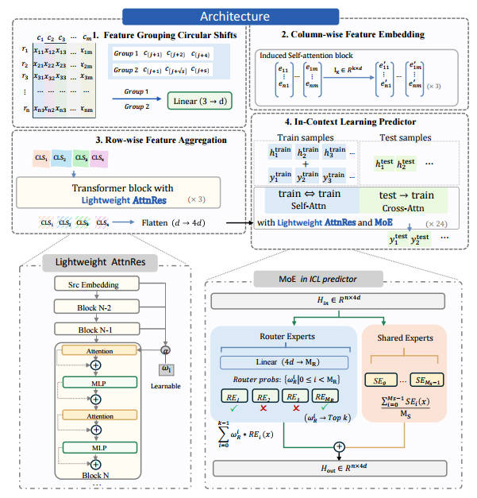
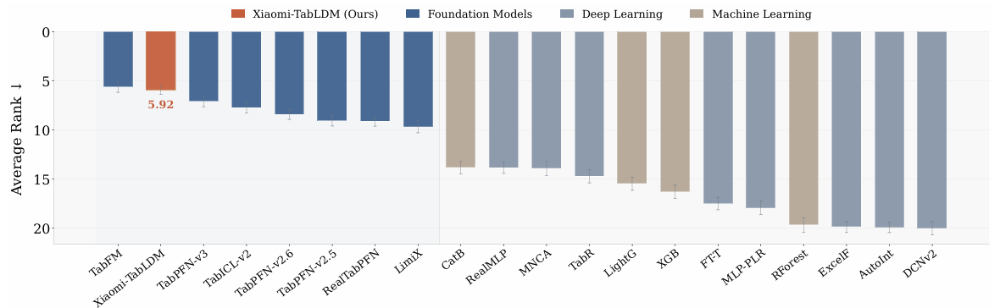
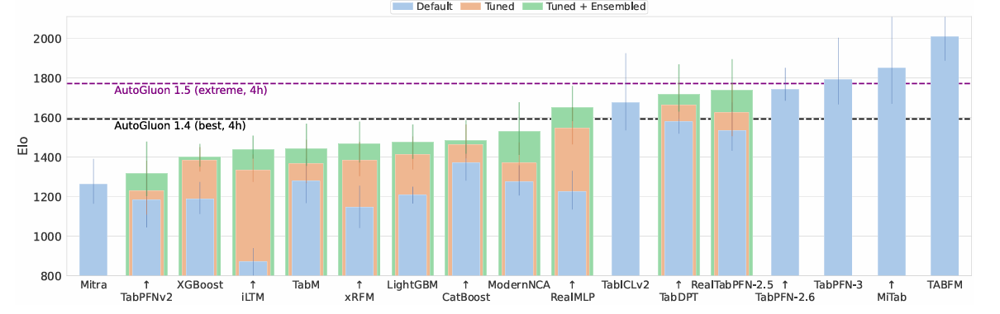
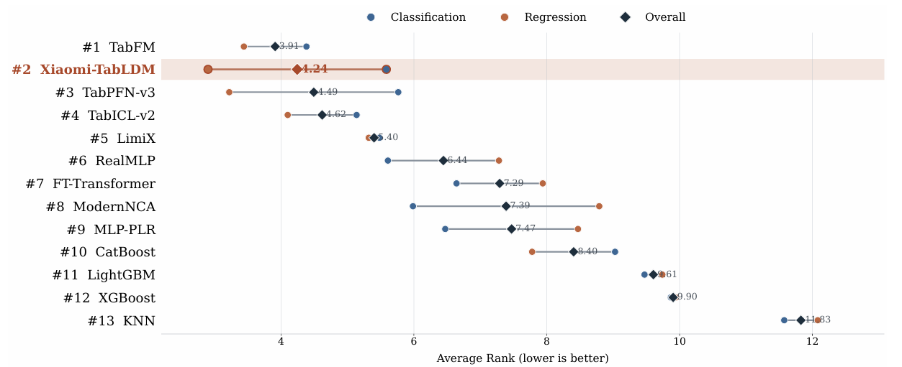
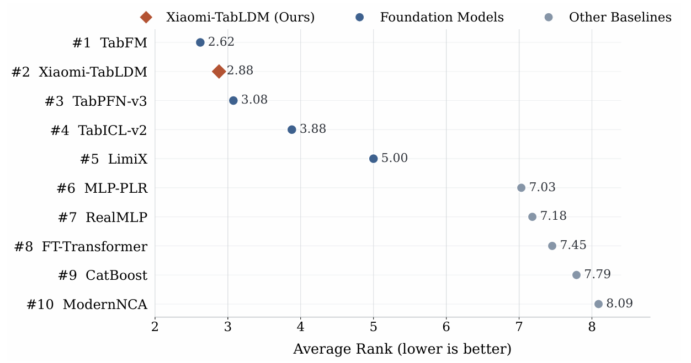
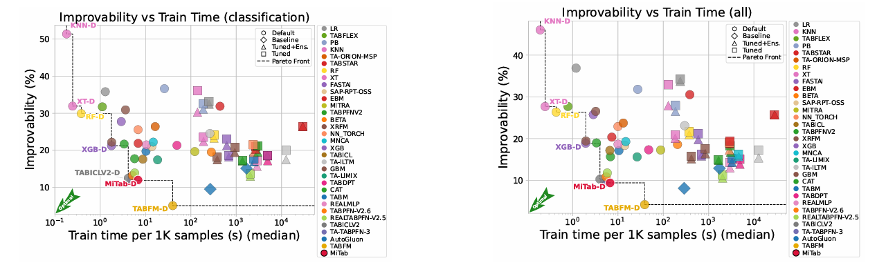

# Xiaomi-TabLDM: 表格基础模型




该仓库是 **Xiaomi-TabLDM** 项目官方实现，包含表格基座大模型 **TabLDM**。

表格基础模型建立了基于上下文学习（in-context learning）通用预测范式。给定下游数据集的带标签样本作为上下文，单个预训练模型即可直接进行预测，无需针对特定任务进行训练。以此为基础，我们引入 TabLDM——一种新的表格基础模型，将该范式进一步扩展至更灵活的上下文利用和更高效的模型容量扩展。

**新的性能标准** 在最具挑战性的TALENT基准上，TabLDM在二分类任务中优于所有基线，整体排名第二。在TabArena上，TabLDM优于传统机器学习基线，整体排名第三，回归任务排名第二。值得注意的是，在与TabPFN-3相近的模型规模下，TabLDM实现了超越，且在总参数量和激活参数量均显著少于TabFM的情况下，性能逼近TabFM。

**大规模合成预训练** TabLDM扩展了用于预训练的合成表格数据的覆盖范围与多样性。我们还改进了三阶段训练策略，逐步引入双流特征组（dual‑stream feature groups）、轻量级注意力残差（lightweight Attention Residual）和稀疏混合专家（sparse Mixture‑of‑Experts），使TabLDM能够学习更丰富的特征交互，并在多样化的表格任务中实现专家专业化。

**测试时扩展（Test‑time scaling）** TabLDM进一步通过测试时计算扩展来提升表格预测性能，即在推理阶段分配更多计算资源，可一致性地提升相较于基础模型的预测表现。

**易于使用：** TabLDM 可通过 `pip` 安装，接口与 scikit-learn 兼容。
`fit` 不会更新权重，仅预处理上下文并加载预训练模型；
预测通过上下文学习（in-context learning）在单次前向传播中完成。

**速度：** 通过 KV 缓存，可在同一份训练数据上多次调用 `predict`
时复用缓存的上下文投影，显著加速重复推理。对较大数据集建议使用 GPU，
并可通过 CPU / 磁盘卸载（offload）扩展到更大的数据规模。

## 性能
<div align="center">
  
  <br>
  <em>Figure 1. Overall rank on TALENT.</em>
</div>

<div align="center">
  
  <br>
  <em>Figure 2. Regression Elo performance on TabArena.</em>
</div>

<div align="center">
  
  <br>
  <em>Figure 3. Average-rank comparison on BCCO. Circles denote the average ranks on BCCO-CLS and BCCO-REG, while diamonds denote the overall average rank across the two settings. </em>
</div>

<div align="center">
  
  <br>
  <em>Figure 4. Average-rank comparison on OpenML-CTR23 over 33 regression datasets.</em>
</div>

<div align="center">
  
  <br>
  <em>Figure 5. Training efficiency and improvability trade-offs across different task types: (left)classification performance, (right)overall tasks.</em>
</div>


## 安装

```bash
cd Xiaomi-TabLDM
pip install .
```

可选依赖可按需安装：

```bash
pip install .[numba]   # 分位数分布层的可选 JIT 加速
pip install .[test]    # 测试依赖
```

在 Intel Mac 上通过 `pip` 安装 PyTorch 可能失败。此时请先安装 PyTorch：

```bash
conda install pytorch -c pytorch
```

然后按上述方式安装 `tabldm`。

### 依赖

`torch>=2.2`、`scikit-learn>=1.3.0`、`numpy`、`scipy`、`einops>=0.7`、
`psutil`、`tqdm>=4.64.0`、`huggingface-hub`。`numba` 为可选依赖。

## 基本用法

### 分类

```python
from tabldm import TabLDMClassifier

clf = TabLDMClassifier(model_path="checkpoints/clf_moe1.ckpt")
clf.fit(X_train, y_train)          # 上下文学习：不更新权重
pred = clf.predict(X_test)
proba = clf.predict_proba(X_test)  # (n_test, n_classes)
```

### 回归

```python
from tabldm import TabLDMRegressor

reg = TabLDMRegressor(model_path="checkpoints/reg_moe1.ckpt")
reg.fit(X_train, y_train)
pred = reg.predict(X_test)
```

> `fit` **不会训练模型**。它仅对有标签上下文（`X_train`、`y_train`）做预处理
> 并加载预训练权重，预测完全通过上下文学习完成。首次使用时会自动从
> Hugging Face Hub 下载 checkpoint（可用 `model_path` 指定本地文件以离线运行）。

### KV 缓存

当需对同一训练数据多次调用 `predict`（如评测时），启用 KV 缓存可避免重复
计算上下文。缓存在 `fit` 时构建，并在后续 `predict` 调用间复用。注意这会占用
额外显存 / 内存，请根据实际场景权衡：

> 对于超过 10 类的分类任务不支持 KV 缓存。此类数据集请保持
> `kv_cache=False`（默认值），否则 `fit` 时会报错。

```python
clf = TabLDMClassifier(
    kv_cache=True, model_path="checkpoints/clf_moe1.ckpt"
)
clf.fit(X_train, y_train)          # 一次性构建缓存
clf.predict(X_test_batch_1)        # 复用缓存的上下文
clf.predict(X_test_batch_2)
```

### 保存 / 加载

```python
clf.save(
    "classifier.pkl",
    save_model_weights=False,  # 若为 False，加载时从 checkpoint 重新读取权重
    save_training_data=True,   # 若为 True，包含训练数据；False 可用于数据隐私
    save_kv_cache=True,        # 若存在 KV 缓存则一并保存
)

from tabldm import TabLDMClassifier
clf = TabLDMClassifier.load("classifier.pkl")
```

若 `save_model_weights=False`（默认），文件更小，但加载时需从 `model_path`
/ Hub 重新读取权重。

## 高级配置

TabLDM 提供一组参数自定义推理行为。以下示例展示分类器的全部可用参数及默认值：

```python
from tabldm import TabLDMClassifier

clf = TabLDMClassifier(
    n_estimators=8,               # 集成成员数，更多更准但更慢
    norm_methods=None,            # 尝试的归一化方法
    feat_shuffle_method="latin",  # 特征排列策略
    class_shuffle_method="shift", # 类别排列策略
    outlier_threshold=4.0,        # 离群点检测 / 截断的 z-score 阈值
    softmax_temperature=0.9,      # 控制预测置信度的温度
    average_logits=True,          # 平均 logits（True）或概率（False）
    support_many_classes=True,    # 自动处理 >10 类
    batch_size=8,                 # 同时处理的集成成员数，降低可省显存
    kv_cache=False,               # 缓存训练数据 KV 投影，加速重复推理
    model_path=None,              # checkpoint 路径，None 则从 Hugging Face 下载
    allow_auto_download=True,     # 本地不存在时自动下载
    checkpoint_version="checkpoints/clf_stage3_moe1_step-10000.ckpt",  # 预训练 checkpoint 版本
    device=None,                  # 推理设备，None 自动选择 CUDA 或 CPU
    use_amp="auto",               # 自动混合精度，加速推理
    use_fa3="auto",               # Hopper GPU（如 H100）的 Flash Attention 3
    offload_mode="auto",          # 自动决定何时使用 CPU / 磁盘卸载
    disk_offload_dir=None,        # 磁盘卸载目录
    random_state=42,              # 可复现性的随机种子
    n_jobs=None,                  # CPU 推理的 PyTorch 线程数
    verbose=False,                # 推理过程打印详细信息
    inference_config=None,        # 面向高级用户的细粒度推理控制
)
```

`TabLDMRegressor` 接受相同参数，但不包含分类专属参数：
`class_shuffle_method`、`softmax_temperature`、`average_logits`、
`support_many_classes`。

在 TALENT 分类测试中，可以通过 `--cat_randomEncode` 让 Ensemble 的每个成员分别对
类别特征列和类别标签执行“类别到整数 code 映射”的随机置换：

```bash
python tests/infer_talent_cls.py --all --seed-num 3 --cat_randomEncode
```

`--cat_random` 也是 `--cat_randomEncode` 的兼容别名，作用相同。

## 加载 checkpoint

checkpoint 按以下顺序解析：

1. **`model_path`** —— 若指向已存在的文件，则直接使用。
2. 若 `model_path` 已设置但文件不存在，且 `allow_auto_download=True`，则按
   `checkpoint_version` 指定的名称下载到 `model_path`。
3. 若 `model_path` 为 `None`，则从 Hugging Face Hub 缓存中获取（以
   `checkpoint_version` 为键）。

当前公开的 MoE1 加载器使用 Hugging Face 仓库
`occams/Xiaomi-TabLDM`。因此，默认分类 checkpoint
`checkpoints/clf_stage3_moe1_step-10000.ckpt` 对应的文件地址为：

```text
https://huggingface.co/occams/Xiaomi-TabLDM/resolve/main/checkpoints/clf_stage3_moe1_step-10000.ckpt
```

`checkpoint_version` 表示该仓库中的文件名，而不是本地文件系统路径。
程序会先从本地 Hugging Face 缓存中查找（通常为
`~/.cache/huggingface/hub`）；如果缓存中不存在，且
`allow_auto_download=True`，则会自动下载。

若需完全离线运行，将 `model_path` 指向本地文件：

```python
clf = TabLDMClassifier(
    model_path="/path/to/step-40000.ckpt", allow_auto_download=False
)
```

## 模型加载对比

以下为 TabICLv2 与 TabLDM 的模型加载开销对比结果：

| 模型 | GPU 显存占用 (GB) | 加载耗时 (s) | 参数量 (M) |
| ---- | ----------------- | ------------ | ---------- |
| TabICLv2 (clf) | 0.106 | 1.184 | 27.552 |
| TabLDM (clf) | 0.271 | 4.533 | 70.075 |
| TabICLv2 (reg) | 0.109 | 1.587 | 28.545 |
| TabLDM (reg) | 0.275 | 4.627 | 71.083 |

## 可用模型

| 模型           | 架构说明                                           | 分类估算器           | 回归估算器          |
| -------------- | -------------------------------------------------- | -------------------- | ------------------- |
| **MoE1** | 2 路由专家（top-1）+ 1 共享专家，MoE 层为最后 8 层 | `TabLDMClassifier` | `TabLDMRegressor` |

> 当前推理包仅支持 MoE1 checkpoint，以保证模型结构与 `state_dict` 对齐。

### MoE checkpoint 示例

对于 TabLDM-MoE checkpoint（例如训练项目产出的 `clf_stage3_..._moe1_...`
产物），需使用匹配的估算器：

```python
from tabldm import TabLDMClassifier   # 2 专家，top-1

clf = TabLDMClassifier(
    model_path="outputs/clf_stage3_..._moe1_.../step-40000.ckpt",
    device="cuda",
)
clf.fit(X_train, y_train)
clf.predict(X_test)
```

对应的回归估算器为 `TabLDMRegressor`。

## 测试

```bash
cd Xiaomi-TabLDM
pytest tests/test_infer_package.py -v
```

测试默认在 `../checkpoints` 中查找 stage3 MoE1 checkpoint，可通过环境变量
`TABLDM_CKPT_DIR` 覆盖。若未找到 checkpoint，测试会自动跳过。

## License

本项目采用 [Apache License 2.0](LICENSE) 发布。

Copyright (C) 2026 Xiaomi Corporation

## FAQ

**什么是 TabLDM？**
TabLDM 是一个表格基础模型（类似 TabPFN / TabICL）。它通过上下文学习
在预训练 Transformer 的单次前向传播中学习新数据：
`y_pred = model(X_train, y_train, X_test)`（在 `predict()` 内部调用）。
其学习能力来自在海量合成数据上的预训练。

**TabLDM 有多快？**
对含 $n$ 条训练行、$m$ 列的数据集，运行时复杂度为 $O(n^2 + nm^2)$。
借助 KV 缓存可在同一训练数据上加速重复推理；通过 CPU / 磁盘卸载可在
不溢出内存的前提下处理更大规模的数据集。

**什么数据规模合适？**
预训练数据覆盖数百至数万训练样本、数列至百余列特征，并可向更大规模
外推；精度可能随规模超出训练分布而下降。具体推荐范围待补充实测数据。

## 预处理

### 内置预处理

对于 `X`，TabLDM 接受 pandas DataFrame 或 numpy 数组，并执行：

- 检测并 ordinal 编码类别列（含字符串、object、category、boolean 类型）。
  对 numpy 数组，所有列共享同一数据类型；整型列视为数值。
- 为类别特征的缺失值创建单独的类别。
- 对缺失数值（编码为 NaN）执行均值插补。
- 离群点检测与截断。
- 特征缩放与归一化。
- 为集成多样性进行特征排列。

## 包结构

```
tabldm/
├── __init__.py          # 公共 API：估算器 + InferenceConfig
├── __about__.py         # 版本号
├── _model/              # PyTorch 模型 + 推理引擎
│   ├── tabldm.py                 # 基础 TabLDM 模块
│   ├── attnres_light_rmsnorm.py # AttnRes / RMSNorm 架构
│   ├── attnres_light_rmsnorm_moe.py # MoE1 架构
│   ├── embedding*.py, interaction.py, learning.py, encoders.py, layers.py
│   ├── attention.py, rope.py, ssmax.py, moe.py, quantile_dist.py
│   ├── kv_cache.py, kv_cache_attnres.py
│   ├── inference.py, inference_config.py
└── _sklearn/            # scikit-learn 接口
    ├── base.py, classifier.py, regressor.py
    ├── preprocessing.py, sklearn_utils.py
    └── *_dualstream_moe.py   # MoE1 估算器
```

## 待补充（TODO）

以下内容参考 [TabICL README](https://github.com/soda-inria/tabicl) 的结构梳理，
目前缺失，待后续补充：

- [ ] **基准测试图表**：无 `docs/figures` 目录，需补充 TabArena / TALENT 等基准
  上的性能对比图与 Pareto 前沿图。
- [ ] **速度与规模实测数据**：FAQ 中的复杂度描述沿用了 TabICL 结论，需补充
  TabLDM 自身在具体硬件（如 H100 / A100 / CPU）上的实测耗时与支持的
  样本 / 特征规模。
- [ ] **论文引用（Citation）**：暂无 TabLDM 论文链接与 BibTeX 条目。
- [ ] **贡献者列表（Contributors）**：待确认作者与维护者名单。
- [ ] **示例教程（tutorials）**：无 `tutorials/` 目录，可补充分类 / 回归 /
  KV 缓存 / MoE 的端到端示例脚本。
- [ ] **高级预处理（skrub 集成说明）**：若验证支持 skrub `TableVectorizer`
  管道，可补充与 TabICL 类似的脏数据预处理示例。
- [ ] **Star History**：待仓库公开后补充 Star History 图。
